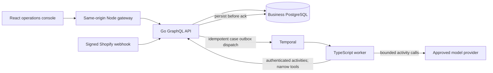

# Architecture and data flow

Submission stores a support case and `workflow_started=false` in one transaction. The dispatcher starts a stable Temporal workflow ID and then marks the outbox entry. If its response is lost, the duplicate workflow start is reconciled; no business mutation depends on a successful dispatch acknowledgement. Workflow replay uses recorded activity results. Model requests, fetches and business mutations run only in activities. Workflow timers and branches are deterministic.

Evidence retrieval uses case-bound tools: callers cannot choose a different order or organization in model arguments. The backend checks requester membership for each tool and requires retrieved current order/policy versions before proposal creation. A proposal stores the authoritative snapshots and canonical action digest. Approval records the exact digest, decision, user and expiry. Approval does not execute the action.

Execution locks the organization row, loads the proposal and approval, rechecks requester/approver membership, action digest, expiry, order version, latest policy version and deterministic eligibility, then conditionally updates the queued order and inserts the unique execution and audit event in the same PostgreSQL transaction. A response lost after commit is reconciled through the stored execution. These are local database atomicity guarantees, not a claim of exactly-once behavior across providers or Shopify.

When evidence changes, the transaction marks the proposal invalidated and the case investigating. Temporal retrieves new evidence. A production order escalates; a newly permitted action would require another exact proposal and approval. Reassessment and wait bounds terminate unsafe or unresolved cases clearly.

Persistence: organizations/users/sessions, orders, immutable policies, cases/outbox flag, proposals, approvals, executions, audit events, tool observations, provider budget reservations, webhook inbox/reconciliation evidence and optional evaluation records. There is no database in the worker and no duplicated operational snapshot database in the UI. JSONB contains flexible attributes/evidence while identity, versions, references and effect constraints are relational.

Local Temporal has its own durable SQLite file. Cloud uses a managed Temporal namespace rather than embedding Temporal into an HTTP service. Business PostgreSQL is separate from workflow infrastructure data. The API's small outbox dispatcher is kept continuously runnable in deployment; the dedicated worker pool polls independently of HTTP requests.
